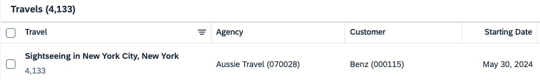
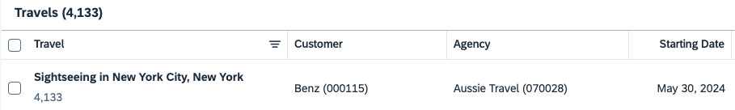
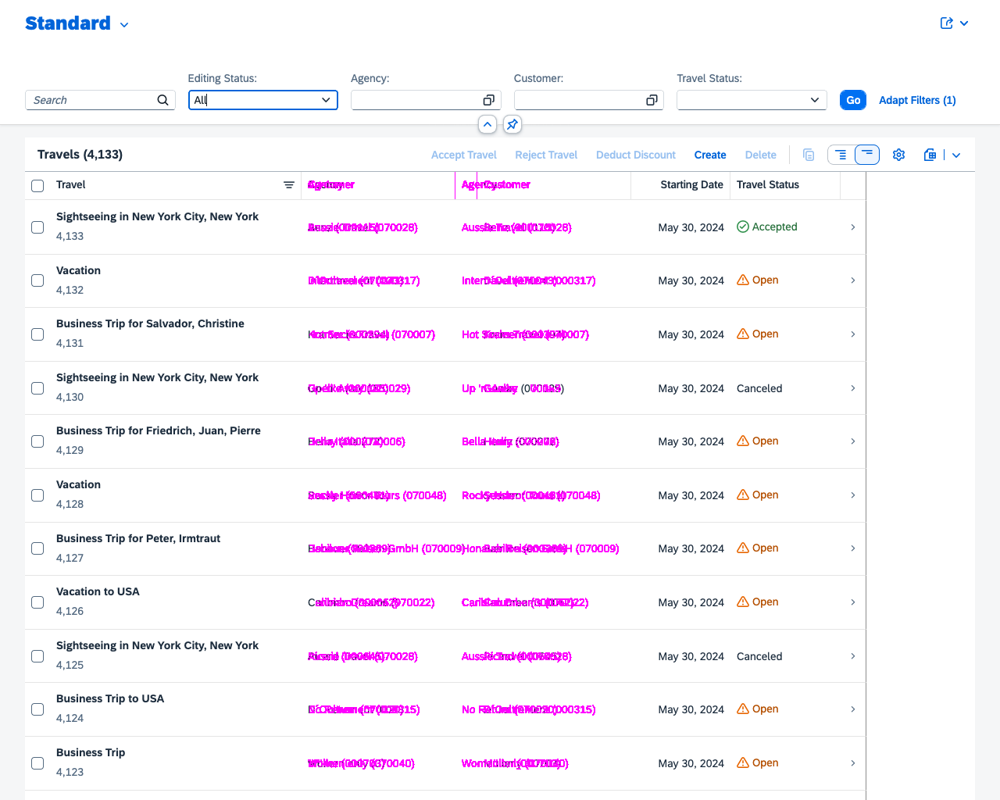

# A simple visual regression test app

This is a sample app to show how visual regression testing can be used for testing web apps. More information about the app and the approach can be read at the following blog post: [Visual regression testing](https://www.itsfullofstars.de).

The recommended approach for the blog post and this app is to go through the steps described in the blog and to use this repository as a reference and help.

# Step 5: Failing UI test

In this step a failing regression test will be shown. The UI test of the previous step 4 will be run again. Just that this time, the app under test is modfied to show a different UI / layout on the main page: the prioroty of column agency in the table changed and is placed differently. This will cause the UI test to fail. The test report will show an error.


## Adjust SAP Demo app: SFLIGHT

To simulate an error, the Sflight demo app must be adjusted. To let the UI test fail, the order of the agency column in the main table will be changed and placed after Customer.

Before:



After:




Edit the file app/travel_processor/layouts.cds ([repo](https://github.com/SAP-samples/cap-sflight/blob/main/app/travel_processor/layouts.cds))

Change 

```json
{
    Value : to_Agency_AgencyID,
    @HTML5.CssDefaults: {width:'16em'}
},  
{
    Value : to_Customer_CustomerID,
    @UI.Importance : #High,
    @HTML5.CssDefaults: {width:'14em'}
},
```

to

```json
{
    Value : to_Customer_CustomerID,
    @UI.Importance : #High,
    @HTML5.CssDefaults: {width:'14em'}
},
{
    Value : to_Agency_AgencyID,
    @HTML5.CssDefaults: {width:'16em'}
},  
```

Start the Sflight app and make sure that the app is running and that the order of the columns changed.

```sh
cds watch
```

## Run visual test

Run the visual regression test. This will access the Sflight app, capture the images and compare them to the baseline.

```sh
npx backstop test
```

This will cause an error. The first test will fail as the captured image and the baseline image do not match. 


The report will not only show that the test fails, but also visually highlght the failed sections. This makes it easy to identify what parts of the UI changed and caused the error.

