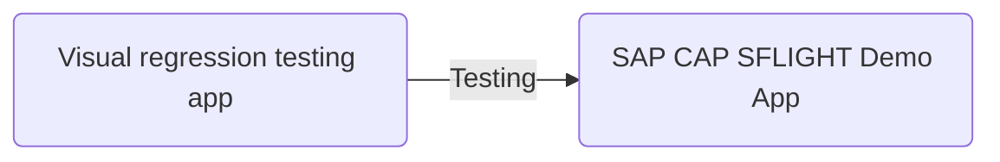
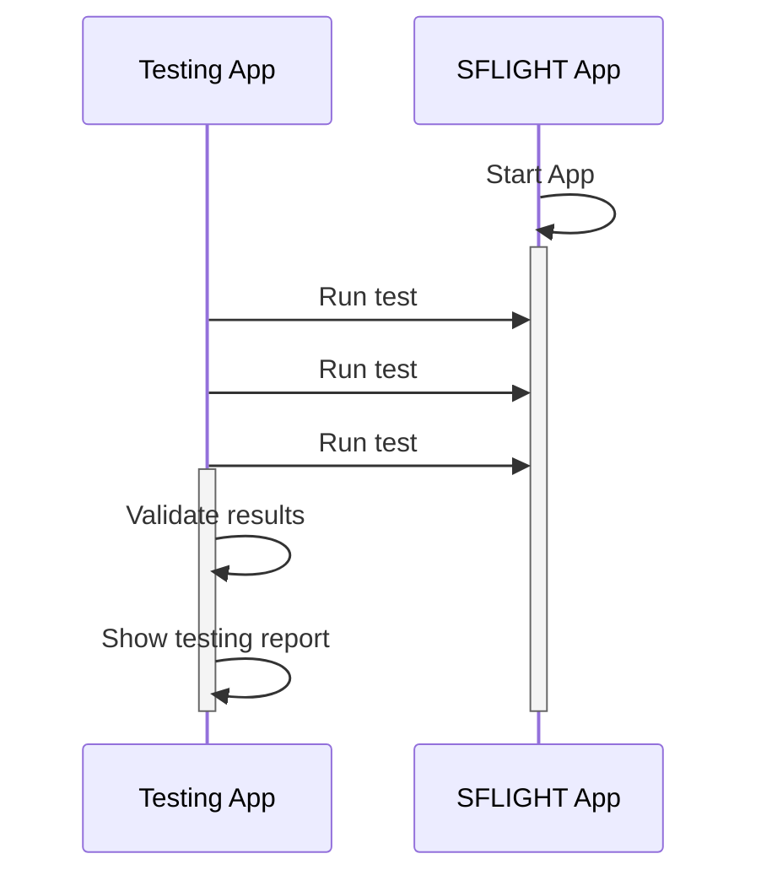

# A simple visual regression test app

This is a sample app to show how visual regression testing can be used for testing web apps. More information about the app and the approach can be read at the following blog post: [Visual regression testing](https://www.itsfullofstars.de).

The recommended approach for the blog post and this app is to go through the steps described in the blog and to use this repository as a reference and help.

## Objective

The objective is to create a visual regression testing app that tests an app for visual changes. The results of the test are presented in a report. The report displays errors in an easy to consume way, helping developers and end users to capture at a glance why tests failed.

## Example testing report

## Overview of the testing app

The app in this repository is the testing app. The app to be tested is [SAP CAP SFLIGHT Demo app](https://github.com/SAP-samples/cap-sflight). The demo app must be installed and run separately. The information on how to do this can be found in the repository of the demo app.

## Running tests

For the tests to work, the app under test must be running and be accessible.

 A series of tests are run from the testing app against the demo. The test results are captured, analyzed and a report is generated.

While the demo app is using SAP technology (Fiori Elements, UI5, CAP), the approach works for any web app.

# Testing app setup

The visual UI regression testing app and repository serves as a learning resource. The steps needed to get from an empty npm project to a working visual regression testing app are described here. The result of each step as described in the blog post [Visual regression testing](https://www.itsfullofstars.de) is available in a separate branch.

1. Step 1: initial project setup. **Branch: [1-init-project](https://github.com/tobiashofmann/simple-visual-regression-test-app/tree/1-init-project)**

    This step will initialze the project and add [BackstopJS](https://github.com/garris/BackstopJS) to it.

2. Step 2: Adding 3 initial tests. **Branch: [2-UI-tests-configuration](https://github.com/tobiashofmann/simple-visual-regression-test-app/tree/2-UI-tests-configuration)**

    This step will configure a desktop client for testing and add 3 tests: home page, travel detail page and booking detail page.

3. Step 3: Creating baseline for tests: **Branch: [3-create-baseline](https://github.com/tobiashofmann/simple-visual-regression-test-app/tree/3-create-baseline)**

    This step will run the 3 initial tests and use them as the baseline.

4. Step 5: Creating baseline for tests: **Branch: [4-visual-test](https://github.com/tobiashofmann/simple-visual-regression-test-app/tree/4-run-first-test)**

   This step will run the UI tests and validate them against the baseline.

5. Step 5: Failing a regression test: **Branch: [5-failed-test](https://github.com/tobiashofmann/simple-visual-regression-test-app/tree/5-failed-test)**

   This step will run the UI tests and validate them against the baseline.