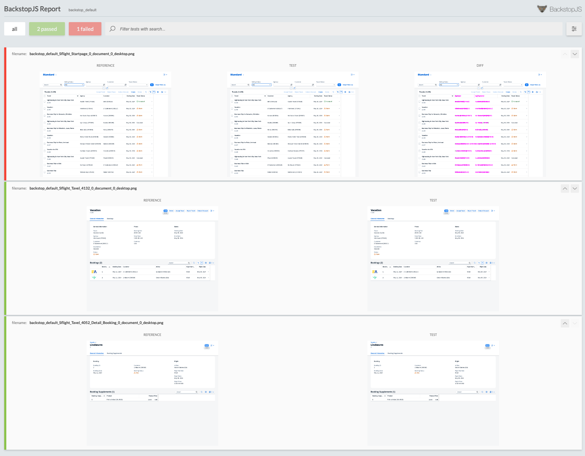

# A simple visual regression test app

This is a sample app to show how visual regression testing can be used for testing web apps. More information about the app and the approach can be read at the following blog post: [Visual regression testing](https://www.itsfullofstars.de).

The recommended approach for the blog post and this app is to go through the steps described in the blog and to use this repository as a reference and help.

# Step 4: Run first UI test

In this step the first visual regressino test is run. The tests are run against the SAP demo app and the resulting images are captured. This step is similar to capturing the baseline images in the previous step 3.

```sh
npx backstop test
```

BackstopJS can now compare the captured images against the baseline image. The generated report will show the result. If everything works, the report will show no errors. This is the case of a successful visual regression test.



In the next step the app under test will be changed so the next run of the visual regression test will fail.